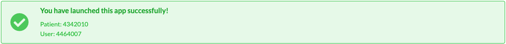
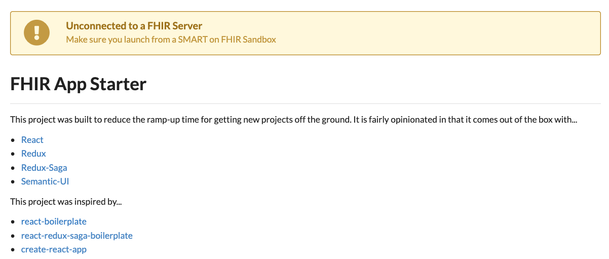
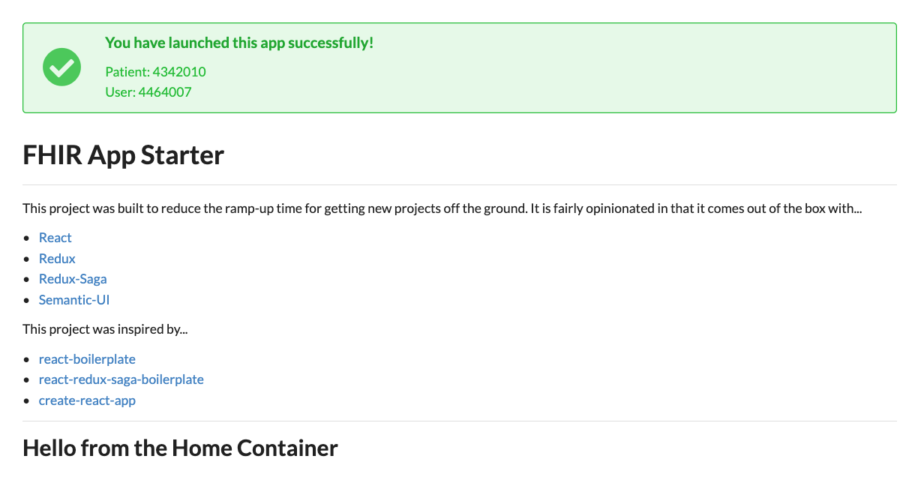

<p align="center">
   
 </p>
 
<p align="center">
   
 </p>

<h2 align="center"><strong>FHIR App Starter</strong></h2>
<h3 align="center">Start building your next FHIR App in seconds. Develop it with modern technologies and a stellar developer experience.</h3>

## Features

**_React_** --

- React first. Build an App in a framework that is future-proof and performant.

**_Redux_** --

- Redux has proven to be the leader in client state management. Use it to store your FHIR documents.

**_Redux-Saga_** --

- Redux Saga is a great way to make asynchronous calls to FHIR servers.

**_Semantic-UI_** --

- Perhaps the most opinionated decision, Semantic-UI is an excellent CSS Framework and component library for building applications.

**_Production Ready_** --

- This project has a scalable component structure utilizing a Container pattern that is ready for Production out of the box.

## Deploy Now

[](https://app.netlify.com/start/deploy?repository=https://github.com/Asymmetrik/fhir-app-starter)

## Getting Started

### Launch from Cerner's Sandbox

1. Create an account on [Cerner's Code Sandbox](https://code.cerner.com/developer/smart-on-fhir/apps) and log in.

2. Create an application by clicking New App

   

   If you are just developing locally, use the following:

|      Config      | Example value                                 |
| :--------------: | --------------------------------------------- |
|     App Name     | Anything you want                             |
| SMART Launch URI | http://localhost:3000/launch.html             |
|   Redirect URI   | http://localhost:3000/                        |
|     App Type     | Provider                                      |
|    FHIR Spec     | DSTU2                                         |
|    Authorized    | Yes                                           |
|  Patient Scopes  | Patient.read Observation.read Condition.read  |
|   User Scopes    | Not needed unless your requirements need this |

2. Clone fhir-app-starter

   ```sh
   git clone https://github.com/asymmetrik/fhir-app-starter
   cd fhir-app-starter
   ```

3. Update your app config

   The app builds the information into the application automatically. All you need to do is update your `config.js`.

   ```js
   // Update me!
   module.exports = {
     clientId: '', // Your clientId
     scope: '', // "patient/Patient.read patient/Observation.read" or: Whatever scopes you like
     iss: '', // Your FHIR Server or: Found on Cerner's Sandbox under "FHIR Spec: dstu2 - " <iss listed here> "
     redirectUri: '', // Your redirectUri
   };
   ```

4. Install and start


    ```sh
    yarn install
    yarn start
    ```

    You should see your browser open up your app.

    

    Notice the "Unconnected..." banner. This is because we have not launched from an EHR yet. Cerner's Code Sandbox allows us to launch the application in this exact way. Let's do that.

5.  Launch from Cerner's Code Sandbox

    On [Cerner's Code Sandbox](https://code.cerner.com/developer/smart-on-fhir/apps), click into your application. Select Begin Testing. Select a Patient, and Select Launch. After launching you may be redirected to a login page. Use username **portal** and password **portal**. If you configured things correctly, you should see that your application has been launched properly.

    

### Building for production

Build for production using the following command:

```sh
yarn build
```

Your app will be located in the `build` directory

### Inspiration

- react-boilerplate
- react-redux-saga-boilerplate
- create-react-app
